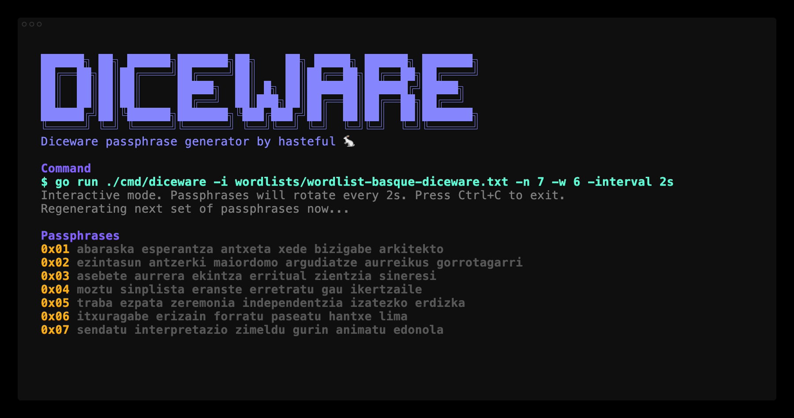
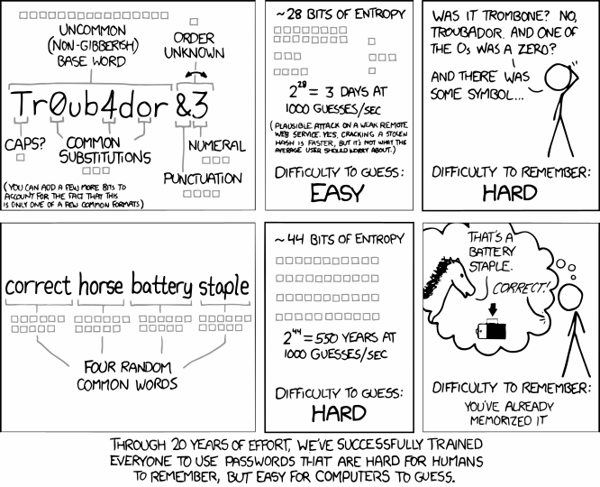

# Diceware [](https://github.com/hastefuI/diceware/actions/workflows/ci.yml) [](https://go.dev) [](https://github.com/hastefuI/diceware/blob/main/LICENSE)

A modern TUI-inspired [Diceware](https://en.wikipedia.org/wiki/Diceware) passphrase generator written in Go with [Lip Gloss](https://github.com/charmbracelet/lipgloss).



## Installation

### Build From Source

```bash
$ go build -o diceware ./cmd/diceware
$ go install ./cmd/diceware
```

### Verify Installation

```bash
$ diceware -h
```

## Quick Start

Generate passphrases:

```bash
$ diceware -i wordlists/wordlist-basque-diceware.txt -n 7 -interval 2s
```

## Usage

```bash
diceware -i <wordlist-file|-> [flags]
  -i          wordlist file, or - for stdin       (required)
  -n          number of passphrases to generate   (default 1)
  -w          number of words per passphrase      (default 6)
  -interval   refresh interval in live mode       (default 5s)
  -once       generate once and exit              (default false)
  -plain      print only the passphrases and exit (default false)
  -h          print help and exit
```

## Motivation

<a href="https://xkcd.com/936/" title="Password Strength by xkcd"></a>

[https://xkcd.com/936/](https://xkcd.com/936/)

## License

Licensed under the [MIT License](https://opensource.org/licenses/MIT). See
[LICENSE](./LICENSE) for details.

Copyright (c) 2026-present hasteful
